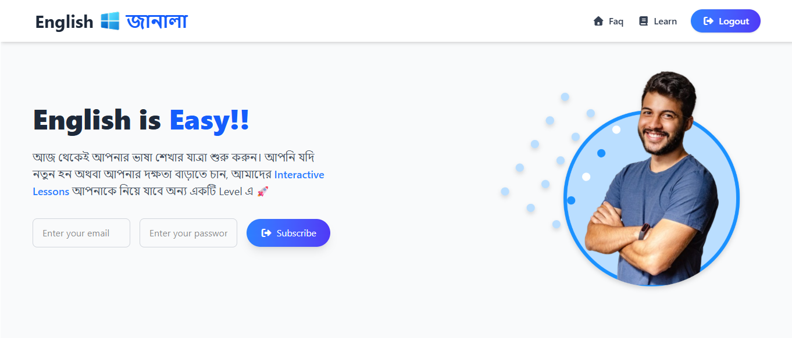

# English Janala




Welcome to English Janala, an interactive web application designed to help Bengali speakers learn English vocabulary in a fun and engaging way.

## Description

English Janala (meaning "English Window") provides a platform for users to learn English words categorized by different levels. Users can browse through lessons, view words with their meanings and pronunciations, and even listen to the correct pronunciation. The project is built with modern web technologies and utilizes an external API for its educational content.

## Features

- **Level-based Learning:** Lessons are structured into different levels, allowing users to progress at their own pace.
- **Interactive Vocabulary Cards:** Each word is displayed on a card with its meaning, pronunciation, and part of speech.
- **Audio Pronunciation:** Users can listen to the correct pronunciation of each word.
- **Word Search:** A search functionality to quickly find specific words.
- **Detailed View:** A modal window provides more detailed information about each word, including example sentences and synonyms.
- **Responsive Design:** The application is designed to work on various devices, including desktops, tablets, and mobile phones.
- **FAQ Section:** A frequently asked questions section to help users navigate the site.

## Technologies Used

- **Frontend:**
  - HTML5
  - Tailwind CSS
  - DaisyUI
  - JavaScript
- **Icons:**
  - Font Awesome
- **API:**
  - [Programming Hero API](https://openapi.programming-hero.com/api) for fetching educational content.

## Getting Started

To run this project locally, you can simply open the `index.html` file in your web browser.

1.  Clone the repository:
    ```bash
    git clone <repository-url>
    ```
2.  Navigate to the project directory:
    ```bash
    cd english-janala
    ```
3.  Open `index.html` in your browser.

## Usage

- Upon loading the page, you will see different lesson levels.
- Click on a level to load the vocabulary words for that lesson.
- You can search for a specific word using the search bar.
- Click on the "Details" button on a word card to see more information.
- Click on the "Listen" button to hear the pronunciation of the word.